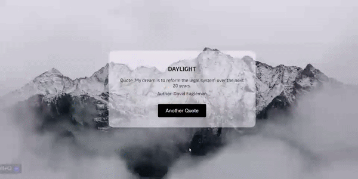

# DAYLIGHT

 

## Description

This project is a simple web application built with Flask that generates random quotes and displays them along with a background image retrieved from external APIs. Users can visit the website to view a new random quote and background image each time they refresh the page.

## Inspiration

In today's fast-paced world, it's easy to feel overwhelmed by the constant stream of information and challenges we face. Amidst this chaos, finding moments of inspiration and motivation can make all the difference in our lives. `DAYLIGHT` aims to provide a simple yet impactful solution by delivering random quotes that can uplift, motivate, and inspire individuals on their journey.

## Features

- Generates random quotes from an external API.
- Retrieves random background images related to nature from another external API.
- Displays the random quote along with its author and a background image on the website's homepage.
- Easy to deploy and use.

## Technologies Used

- **Python**: Backend language used for server-side logic.
- **Flask**: Micro web framework used for building the web application.
- **Requests**: Python library used for making HTTP requests to external APIs.
- **dotenv**: Python library used for loading environment variables from a `.env` file.
- **HTML/CSS**: Frontend markup and styling for the website.

## Setup Instructions

1. Clone the repository to your local machine:

    ```
    git clone https://github.com/SIMRAN719/Daylight.git
    ```

2. Install the required Python packages:

    ```
    pip install flask requests python-dotenv
    ```

3. Create a `.env` file in the project directory and add your API keys:

    ```
    Quote_API_Key= `YOUR_QUOTE_API_KEY`
    Background_API_Key= `YOUR_BACKGROUND_API_KEY`
    ```

4. Run the Flask application:

    ```
    python main.py
    ```

5. Access the website in your browser at `http://localhost:5000`.

## Usage

- Upon accessing the website, a random quote along with its author and a background image will be displayed on the homepage.
- Refresh the page to view a new random quote and background image.

## Credits

- This project utilizes the following APIs:
  - **Quote API**: [API-Ninjas](https://api.api-ninjas.com/)
  - **Background Image API**: [Unsplash](https://unsplash.com/)


## License

This project is licensed under the [MIT License](LICENSE).

---

Feel free to customize this README according to your project's specific details and requirements.